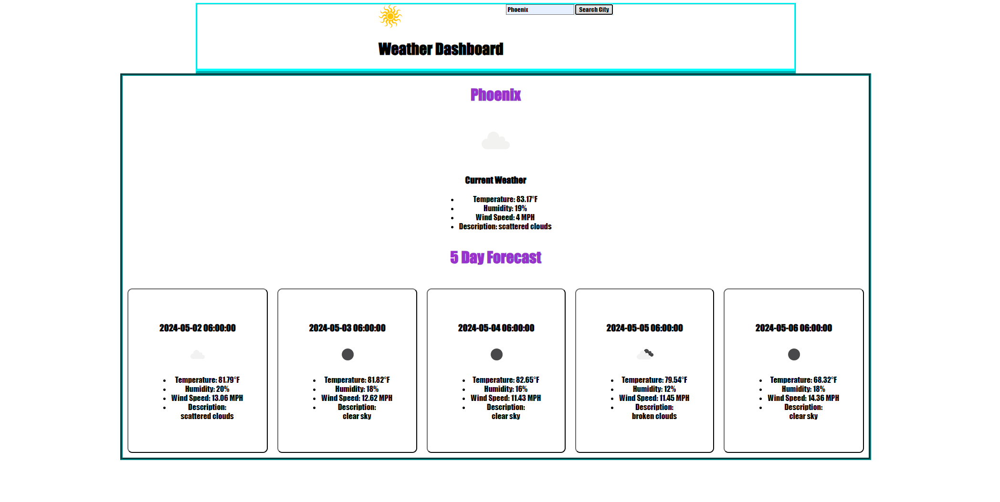

# Orion's Weather Dashboard

## Description

This is an application which allows you to grab the current weather as well as a 5 day weather forecasat for a desired city

## Table of Contents

- [Installation](#installation)
- [Usage](#usage)
- [License](#license)
- [Contributing](#contributing)
- [Tests](#tests)
- [Questions](#questions)

## Installation

go to my github pages deployed website

## Usage

Enter in a city name and instantly get back weather for the city

## Screenshot

## License

https://opensource.org/licenses/MIT

This project is licensed under the MIT License.

## Contributing

n/a

## Tests

Users can test any city name they would like.

## Questions

If you have any questions about this project, you can reach me at orion.m.cannon@gmail.com
or you can find me on GitHub at [OrionC11](https://github.com/OrionC11).
